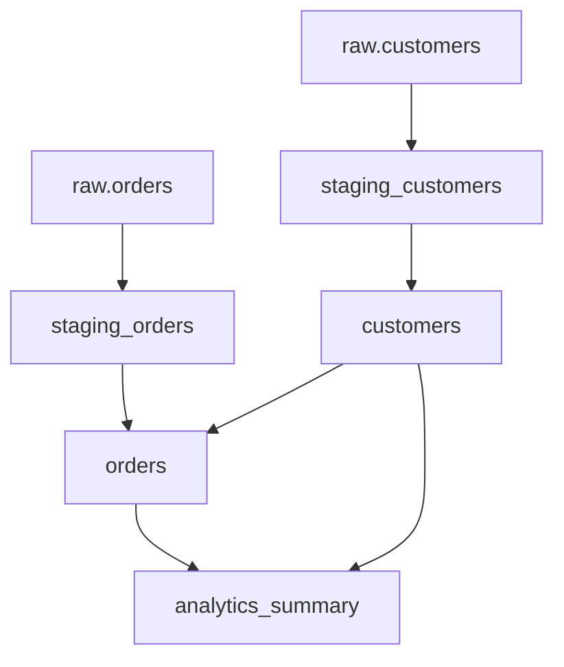

# Display Data Lineage

Show data lineage graph for assets, including upstream dependencies and downstream consumers.

## Arguments

- `$ARGUMENTS`: Optional asset name to focus lineage graph (default: show all lineage)

## Data Lineage Sources

### Source 1: dbt DAG (if dbt project exists)

1. **Find dbt manifest**:
   - Check `target/manifest.json` in dbt project
   - Or find via: `find . -name "manifest.json" -path "*/target/*"`

2. **Parse manifest for lineage**:
   - Extract `nodes` (models, seeds, snapshots)
   - Extract `sources`
   - Extract `depends_on` relationships

3. **Build dbt lineage graph**:
   ```
   Sources:
   - raw.customers
   - raw.orders

   Models:
   ├─ staging_customers (depends on: raw.customers)
   ├─ staging_orders (depends on: raw.orders)
   ├─ customers (depends on: staging_customers)
   ├─ orders (depends on: staging_orders, customers)
   └─ analytics_summary (depends on: orders, customers)
   ```

### Source 2: Dagster Asset Graph

1. **Check if Dagster is available**:
   - Verify: `python -c "import dagster; print('OK')"`

2. **Load Dagster definitions**:
   - Find definitions file: `rg "Definitions|defs" --type py`
   - Load asset dependencies from Dagster

3. **Extract asset lineage**:
   - Asset keys
   - Upstream dependencies (`deps`, `ins`)
   - Downstream consumers

### Source 3: OpenLineage (if configured)

1. **Check OpenLineage configuration**:
   - Read CompiledArtifacts: `cat target/compiled_artifacts.json`
   - Look for `observability.openlineage_endpoint`

2. **Query OpenLineage API** (if endpoint available):
   ```bash
   curl http://localhost:5000/api/v1/lineage?nodeId=<dataset_id>
   ```

3. **Parse lineage graph** from OpenLineage:
   - Input datasets
   - Output datasets
   - Jobs/transformations
   - Run-level lineage

## Lineage Visualization

### ASCII Graph Format

For a focused asset (if `$ARGUMENTS` provided):

```
Lineage for: orders
==================

Upstream (3 levels):
└─ orders
   ├─ staging_orders
   │  └─ raw.orders (source)
   └─ customers
      └─ staging_customers
         └─ raw.customers (source)

Downstream (2 levels):
orders
├─ analytics_summary
│  └─ daily_reports
└─ customer_metrics
```

### Full DAG View

If no specific asset requested, show full DAG:

```
Data Lineage Graph
==================

Sources:
├─ raw.customers
├─ raw.orders
└─ raw.payments

Staging Layer:
├─ staging_customers ← raw.customers
├─ staging_orders ← raw.orders
└─ staging_payments ← raw.payments

Core Layer:
├─ customers ← staging_customers
├─ orders ← staging_orders, customers
└─ payments ← staging_payments, orders

Analytics Layer:
├─ analytics_summary ← orders, customers, payments
└─ daily_reports ← analytics_summary
```

### Metadata Enrichment

For each asset, include metadata:

```
Asset: orders
==================
Type:           dbt model
Materialization: table
Owner:          data-team
Classification: INTERNAL
Dependencies:   2 upstream, 3 downstream
Last Updated:   2025-12-12 12:00:12

Upstream:
├─ staging_orders (dbt model, INTERNAL)
└─ customers (dbt model, PII)

Downstream:
├─ analytics_summary (dbt model, INTERNAL)
├─ customer_metrics (dbt model, PII)
└─ daily_reports (dbt model, PUBLIC)
```

## Classification Propagation

Show how data classifications flow through lineage:

```
Classification Lineage for: orders
==================

🔒 PII columns (propagated from customers):
├─ customer_id → orders.customer_id → analytics_summary.customer_id
└─ email → customers.email → [NOT PROPAGATED]

🔐 SENSITIVE columns:
└─ payment_amount → orders.payment_amount → analytics_summary.total_revenue
```

## Lineage Commands

### dbt-based Lineage

```bash
# Show upstream models for a specific model
dbt ls --select +orders

# Show downstream models
dbt ls --select orders+

# Show full lineage
dbt ls --select +orders+
```

### Dagster-based Lineage

If Dagster is running:

```bash
# List all assets
dagster asset list

# Show asset dependencies (if CLI supports)
dagster asset show orders
```

## Output Formats

### Option 1: Text (default)
ASCII tree format shown above

### Option 2: Mermaid Diagram
Generate Mermaid syntax for visualization:



### Option 3: JSON
```json
{
  "asset": "orders",
  "upstream": [
    {"name": "staging_orders", "type": "dbt_model"},
    {"name": "customers", "type": "dbt_model"}
  ],
  "downstream": [
    {"name": "analytics_summary", "type": "dbt_model"},
    {"name": "customer_metrics", "type": "dbt_model"}
  ]
}
```

## Impact Analysis

If user is investigating changes to an asset:

```
Impact Analysis: modifying 'customers'
==================

⚠️  Downstream Impact:
├─ orders (2 transformations affected)
├─ analytics_summary (will need refresh)
├─ daily_reports (cascading dependency)
└─ customer_metrics (direct dependency)

Recommendation:
- Run tests on all downstream assets
- Consider incremental refresh strategy
- Notify consumers: data-team, analytics-team
```

## Error Handling

- **No manifest found**: "dbt project not compiled. Run `dbt compile` or `/compile` first."
- **No Dagster definitions**: "Dagster not configured. Showing dbt lineage only."
- **Asset not found**: List available assets and suggest closest match
- **Empty lineage**: "Asset has no dependencies. It may be a source."

## Next Steps

After viewing lineage:
1. Run specific model: `dbt run --select +orders`
2. Test lineage: `dbt test --select +orders+`
3. Materialize in Dagster: Use Dagster UI or API
4. Export lineage: Save to file for documentation
