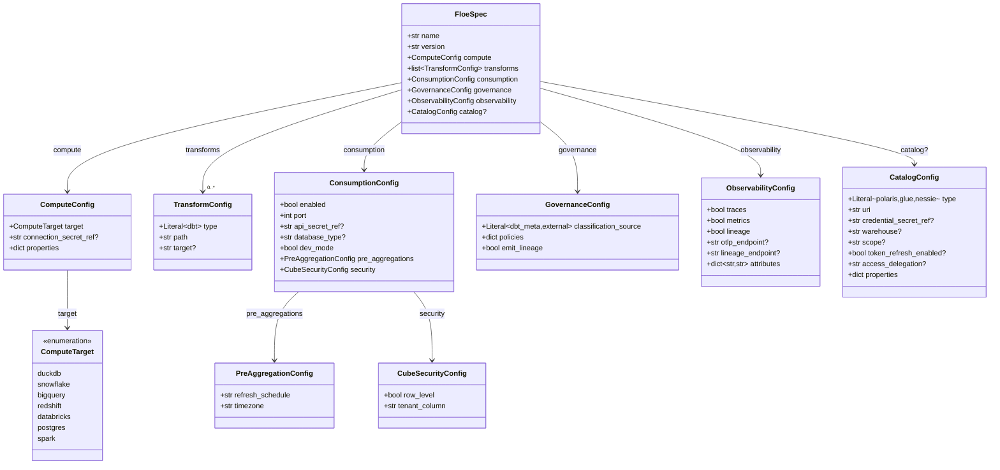
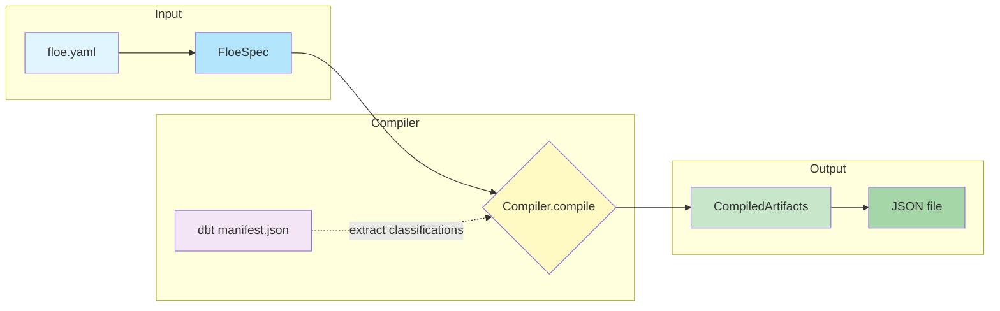
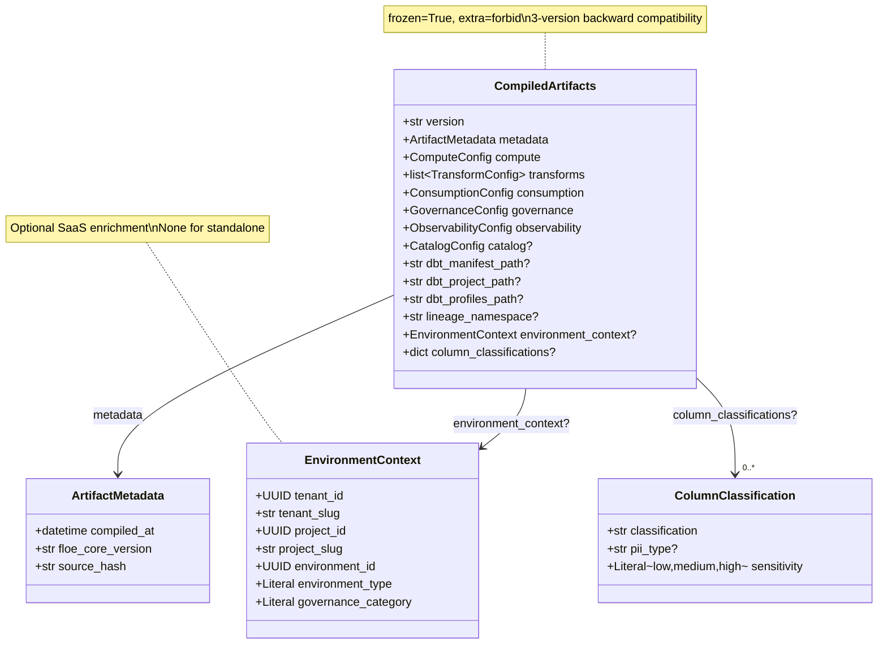
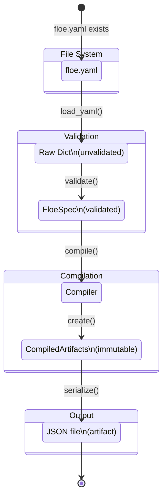
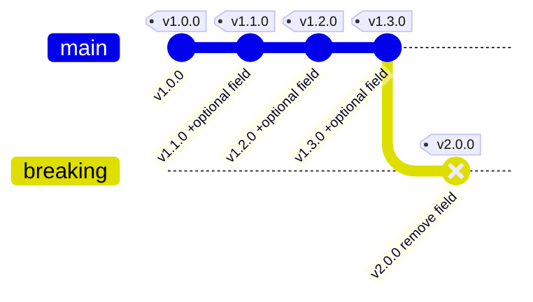

# Data Model: Core Foundation Package (floe-core)

**Feature**: 001-core-foundation
**Date**: 2025-12-15
**Status**: Complete (Updated with validation fixes)
**Revision**: 2 - Added Polaris OAuth2 fields, database_type, dbt_profiles_path default, implementation notes

## Overview

This document defines all Pydantic models for floe-core, extracted from the feature specification. The models are organized into two categories:

1. **Input Models** (FloeSpec hierarchy) - For parsing and validating `floe.yaml`
2. **Output Models** (CompiledArtifacts) - Immutable contract for downstream packages

---

## Entity Relationship Diagram

### FloeSpec (Input) Hierarchy



### Compilation Flow



### CompiledArtifacts (Output) Contract



---

## Input Models (FloeSpec Hierarchy)

### FloeSpec

Root configuration model representing a complete `floe.yaml` definition.

| Field | Type | Required | Default | Description |
|-------|------|----------|---------|-------------|
| name | str | Yes | - | Pipeline name (1-100 chars, alphanumeric with hyphens/underscores) |
| version | str | Yes | - | Pipeline version (semver format) |
| compute | ComputeConfig | Yes | - | Compute target configuration |
| transforms | list[TransformConfig] | No | [] | List of transformation steps |
| consumption | ConsumptionConfig | No | ConsumptionConfig() | Semantic layer configuration |
| governance | GovernanceConfig | No | GovernanceConfig() | Data governance configuration |
| observability | ObservabilityConfig | No | ObservabilityConfig() | Observability configuration |
| catalog | CatalogConfig | None | None | Iceberg catalog configuration |

**Validation Rules**:
- `name` must match pattern `^[a-zA-Z][a-zA-Z0-9_-]{0,99}$`
- `version` must be valid semver (e.g., "1.0.0", "2.1.3-beta")
- Model is immutable (`frozen=True`) and rejects unknown fields (`extra="forbid"`)

---

### ComputeTarget (Enum)

Supported compute targets matching dbt adapter names.

| Value | Description |
|-------|-------------|
| duckdb | DuckDB (local development) |
| snowflake | Snowflake Data Cloud |
| bigquery | Google BigQuery |
| redshift | Amazon Redshift |
| databricks | Databricks Lakehouse |
| postgres | PostgreSQL |
| spark | Apache Spark |

---

### ComputeConfig

Configuration for compute target.

| Field | Type | Required | Default | Description |
|-------|------|----------|---------|-------------|
| target | ComputeTarget | Yes | - | Compute target enum value |
| connection_secret_ref | str | None | None | K8s secret name for credentials |
| properties | dict[str, Any] | No | {} | Target-specific properties |

**Validation Rules**:
- `connection_secret_ref` must match K8s naming: `^[a-zA-Z0-9][a-zA-Z0-9_-]{0,252}$`

**Target-Specific Properties**:

| Target | Properties |
|--------|------------|
| duckdb | `path` (str, default ":memory:"), `extensions` (list[str]) |
| snowflake | `account` (str), `warehouse` (str), `role` (str?), `database` (str?), `schema` (str?) |
| bigquery | `project` (str), `dataset` (str), `location` (str?), `method` (str?) |
| redshift | `host` (str), `port` (int), `database` (str) |
| databricks | `host` (str), `http_path` (str), `catalog` (str?) |
| postgres | `host` (str), `port` (int, default 5432), `database` (str) |
| spark | `master` (str), `deploy_mode` (str?), `configurations` (dict?) |

---

### TransformConfig

Configuration for a transformation step.

| Field | Type | Required | Default | Description |
|-------|------|----------|---------|-------------|
| type | Literal["dbt"] | Yes | - | Transform type discriminator |
| path | str | Yes | - | Path to transform source (relative to floe.yaml) |
| target | str | None | None | Optional target override |

**Future Extension**: `type` will support `"python"`, `"flink"` in future versions.

---

### ConsumptionConfig

Configuration for Cube semantic layer.

| Field | Type | Required | Default | Description |
|-------|------|----------|---------|-------------|
| enabled | bool | No | False | Enable Cube semantic layer |
| port | int | No | 4000 | Cube API port |
| api_secret_ref | str | None | None | K8s secret for Cube API key |
| database_type | str | None | None | Database driver type (postgres, snowflake, bigquery, duckdb, etc.) |
| dev_mode | bool | No | False | Enable Cube Playground in development |
| pre_aggregations | PreAggregationConfig | No | PreAggregationConfig() | Pre-aggregation settings |
| security | CubeSecurityConfig | No | CubeSecurityConfig() | Row-level security settings |

**Database Type**:
When `enabled=True`, Cube requires `database_type` to select the correct driver. If not specified, it is inferred from `compute.target`:

| compute.target | Inferred database_type |
|----------------|------------------------|
| duckdb | duckdb |
| snowflake | snowflake |
| bigquery | bigquery |
| redshift | redshift |
| databricks | databricks |
| postgres | postgres |
| spark | (requires explicit setting) |

---

### PreAggregationConfig

Configuration for Cube pre-aggregations.

| Field | Type | Required | Default | Description |
|-------|------|----------|---------|-------------|
| refresh_schedule | str | No | "*/30 * * * *" | Cron expression for refresh |
| timezone | str | No | "UTC" | Timezone for schedule |

---

### CubeSecurityConfig

Configuration for Cube row-level security.

| Field | Type | Required | Default | Description |
|-------|------|----------|---------|-------------|
| row_level | bool | No | True | Enable row-level security |
| tenant_column | str | No | "tenant_id" | Column for tenant filtering |

---

### GovernanceConfig

Configuration for data governance.

| Field | Type | Required | Default | Description |
|-------|------|----------|---------|-------------|
| classification_source | Literal["dbt_meta", "external"] | No | "dbt_meta" | Source for classifications |
| policies | dict[str, Any] | No | {} | Policy definitions |
| emit_lineage | bool | No | True | Emit OpenLineage events |

---

### ObservabilityConfig

Configuration for observability.

| Field | Type | Required | Default | Description |
|-------|------|----------|---------|-------------|
| traces | bool | No | True | Enable OpenTelemetry traces |
| metrics | bool | No | True | Enable metrics collection |
| lineage | bool | No | True | Enable OpenLineage emission |
| otlp_endpoint | str | None | None | OTLP exporter endpoint |
| lineage_endpoint | str | None | None | OpenLineage API endpoint |
| attributes | dict[str, str] | No | {} | Custom trace attributes |

---

### CatalogConfig

Configuration for Iceberg catalog integration.

| Field | Type | Required | Default | Description |
|-------|------|----------|---------|-------------|
| type | Literal["polaris", "glue", "nessie"] | Yes | - | Catalog type |
| uri | str | Yes | - | Catalog endpoint URI |
| credential_secret_ref | str | None | None | K8s secret for credentials |
| warehouse | str | None | None | Default warehouse name |
| scope | str | None | None | OAuth2 scope (Polaris: e.g., "PRINCIPAL_ROLE:ALL") |
| token_refresh_enabled | bool | None | None | Enable OAuth2 token refresh for long-lived connections |
| access_delegation | str | None | None | Iceberg access delegation header (e.g., "vended-credentials") |
| properties | dict[str, Any] | No | {} | Catalog-specific properties |

**Validation Rules**:
- `credential_secret_ref` must match K8s naming convention
- `scope` required when using Polaris with OAuth2 authentication

**Catalog-Specific Configuration**:

| Catalog | Required Properties | Optional Properties |
|---------|---------------------|---------------------|
| polaris | `scope` (via field) | `token_refresh_enabled`, `access_delegation` |
| glue | `region` (in properties) | `catalog_id`, `session_token` |
| nessie | - | `branch`, `hash`, `reference` (in properties) |

---

## Output Models (CompiledArtifacts)

### CompiledArtifacts

Immutable output contract from compilation. All downstream packages (floe-dagster, floe-dbt, floe-cube, floe-polaris) consume this contract.

| Field | Type | Required | Default | Description |
|-------|------|----------|---------|-------------|
| version | str | No | "1.0.0" | Contract version (semver) |
| metadata | ArtifactMetadata | Yes | - | Compilation metadata |
| compute | ComputeConfig | Yes | - | Compute configuration |
| transforms | list[TransformConfig] | Yes | - | Transform configurations |
| consumption | ConsumptionConfig | Yes | - | Consumption configuration |
| governance | GovernanceConfig | Yes | - | Governance configuration |
| observability | ObservabilityConfig | Yes | - | Observability configuration |
| catalog | CatalogConfig | None | None | Catalog configuration |
| dbt_manifest_path | str | None | None | Path to dbt manifest.json |
| dbt_project_path | str | None | None | Path to dbt project directory |
| dbt_profiles_path | str | No | ".floe/profiles" | Path to profiles directory (required by dagster-dbt) |
| lineage_namespace | str | None | None | OpenLineage namespace (SaaS) |
| environment_context | EnvironmentContext | None | None | SaaS environment context |
| column_classifications | dict[str, dict[str, ColumnClassification]] | None | None | Extracted classifications |

**Contract Rules**:
- Model is immutable (`frozen=True`)
- Unknown fields rejected (`extra="forbid"`)
- 3-version backward compatibility maintained
- JSON Schema exported for cross-language validation

---

### ArtifactMetadata

Compilation metadata.

| Field | Type | Required | Default | Description |
|-------|------|----------|---------|-------------|
| compiled_at | datetime | Yes | - | Compilation timestamp (UTC) |
| floe_core_version | str | Yes | - | floe-core package version |
| source_hash | str | Yes | - | SHA-256 hash of floe.yaml |

---

### EnvironmentContext

Optional runtime context from Control Plane (SaaS enrichment).

| Field | Type | Required | Default | Description |
|-------|------|----------|---------|-------------|
| tenant_id | UUID | Yes | - | Tenant identifier |
| tenant_slug | str | Yes | - | Human-readable tenant slug |
| project_id | UUID | Yes | - | Project identifier |
| project_slug | str | Yes | - | Human-readable project slug |
| environment_id | UUID | Yes | - | Environment identifier |
| environment_type | Literal["development", "preview", "staging", "production"] | Yes | - | Environment type |
| governance_category | Literal["production", "non_production"] | Yes | - | Governance category |

**Note**: This is optional per Standalone-First principle. Standalone deployments set this to `None`.

---

### ColumnClassification

Classification metadata for a single column.

| Field | Type | Required | Default | Description |
|-------|------|----------|---------|-------------|
| classification | str | Yes | - | Classification type (e.g., "pii", "confidential") |
| pii_type | str | None | None | Specific PII type (e.g., "email", "phone") |
| sensitivity | Literal["low", "medium", "high"] | No | "medium" | Sensitivity level |

---

## State Transitions

### FloeSpec Lifecycle



### CompiledArtifacts Version Evolution



**Backward Compatibility Window: 3 versions**

| Contract Version | Supports Consumers Expecting |
|------------------|------------------------------|
| v1.3.0 | v1.0.0, v1.1.0, v1.2.0 |
| v2.0.0 | v1.1.0, v1.2.0, v1.3.0 |

> **Note**: MAJOR version bumps (e.g., v2.0.0) are triggered by breaking changes like removing a field or changing a type. These drop support for the oldest compatible version.

---

## Validation Rules Summary

| Model | Rule | Error Message |
|-------|------|---------------|
| FloeSpec.name | `^[a-zA-Z][a-zA-Z0-9_-]{0,99}$` | "Pipeline name must start with letter, contain only alphanumeric/hyphens/underscores, max 100 chars" |
| FloeSpec.version | Valid semver | "Version must be valid semantic version (e.g., 1.0.0)" |
| ComputeConfig.connection_secret_ref | `^[a-zA-Z0-9][a-zA-Z0-9_-]{0,252}$` | "Secret reference must be K8s compatible: alphanumeric start, max 253 chars" |
| CatalogConfig.credential_secret_ref | Same as above | Same as above |
| ConsumptionConfig.api_secret_ref | Same as above | Same as above |
| ComputeConfig.target | One of enum values | "Invalid compute target 'X'. Valid options: duckdb, snowflake, bigquery, redshift, databricks, postgres, spark" |

---

## JSON Schema Export

Both FloeSpec and CompiledArtifacts export JSON Schema Draft 2020-12 via `model_json_schema()`.

**FloeSpec Schema** (`floe-spec.schema.json`):
- Purpose: IDE autocomplete for `floe.yaml` editing
- Usage: Add `$schema: ./schemas/floe-spec.schema.json` to floe.yaml

**CompiledArtifacts Schema** (`compiled-artifacts.schema.json`):
- Purpose: Cross-language contract validation
- Usage: Validate compiled JSON artifacts before consumption

---

## Implementation Notes

### Mutable Defaults with frozen=True (CRITICAL)

All models use `frozen=True` for immutability. When using mutable default values (lists, dicts, model instances), you **MUST** use `Field(default_factory=...)` to avoid shared state:

```python
from pydantic import BaseModel, Field, ConfigDict

class FloeSpec(BaseModel):
    model_config = ConfigDict(frozen=True, extra="forbid")

    # ✅ CORRECT: Use default_factory for mutable defaults
    transforms: list[TransformConfig] = Field(default_factory=list)
    consumption: ConsumptionConfig = Field(default_factory=ConsumptionConfig)
    governance: GovernanceConfig = Field(default_factory=GovernanceConfig)
    observability: ObservabilityConfig = Field(default_factory=ObservabilityConfig)

    # ❌ WRONG: Direct mutable defaults cause shared state
    # transforms: list[TransformConfig] = []  # DON'T DO THIS
    # consumption: ConsumptionConfig = ConsumptionConfig()  # DON'T DO THIS
```

**Fields requiring `default_factory`:**

| Model | Field | Correct Implementation |
|-------|-------|------------------------|
| FloeSpec | transforms | `Field(default_factory=list)` |
| FloeSpec | consumption | `Field(default_factory=ConsumptionConfig)` |
| FloeSpec | governance | `Field(default_factory=GovernanceConfig)` |
| FloeSpec | observability | `Field(default_factory=ObservabilityConfig)` |
| ComputeConfig | properties | `Field(default_factory=dict)` |
| ConsumptionConfig | pre_aggregations | `Field(default_factory=PreAggregationConfig)` |
| ConsumptionConfig | security | `Field(default_factory=CubeSecurityConfig)` |
| GovernanceConfig | policies | `Field(default_factory=dict)` |
| ObservabilityConfig | attributes | `Field(default_factory=dict)` |
| CatalogConfig | properties | `Field(default_factory=dict)` |

### Discriminated Unions for Future Extension

When adding `"python"` and `"flink"` transform types, use Pydantic discriminated unions:

```python
from typing import Annotated, Literal, Union
from pydantic import Field

class DBTTransformConfig(BaseModel):
    type: Literal["dbt"]
    path: str
    target: str | None = None

class PythonTransformConfig(BaseModel):
    type: Literal["python"]
    path: str
    handler_function: str

TransformConfig = Annotated[
    Union[DBTTransformConfig, PythonTransformConfig],
    Field(discriminator='type')
]
```

### Secret References vs Actual Secrets

Fields ending in `_secret_ref` are **K8s secret names** (references), NOT actual secret values:

```python
# These are STRING references to K8s secrets, validated by K8s naming pattern
# Do NOT use SecretStr - these are not the actual secret values
connection_secret_ref: str | None = Field(
    None,
    pattern=r"^[a-zA-Z0-9][a-zA-Z0-9_-]{0,252}$",
    description="K8s secret name (reference, not actual secret value)"
)
```

Actual secret resolution happens at runtime by floe-dagster, not at compile time.
