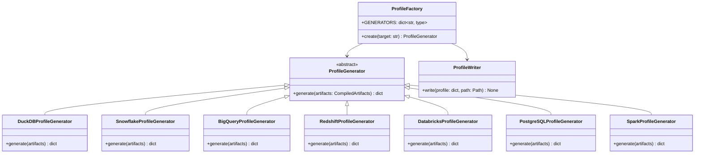
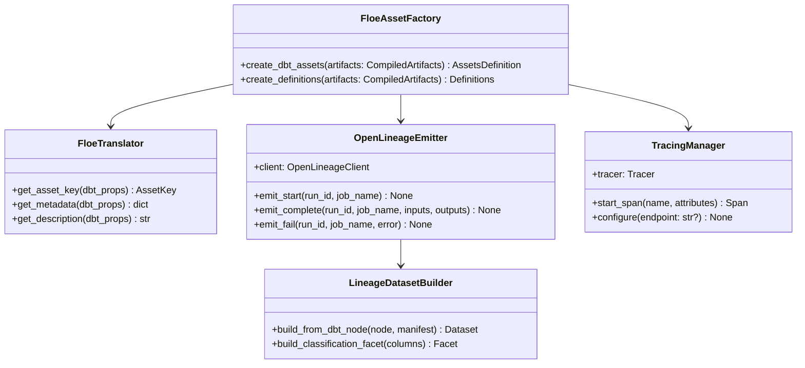

# Data Model: Orchestration Layer

**Feature**: 003-orchestration-layer
**Date**: 2025-12-16
**Status**: Draft
**Spec**: [spec.md](spec.md) | **Research**: [research.md](research.md)

## Overview

This document defines all Pydantic models for the orchestration layer packages:

1. **floe-dbt** - Profile generation models for 7 compute targets
2. **floe-dagster** - Asset creation, lineage, and observability models

All models follow Constitution principles:
- Type Safety (Pydantic v2)
- Security First (SecretStr, env var refs)
- Standalone First (graceful degradation)

---

## Entity Relationship Diagram

### floe-dbt Profile Generation



### floe-dagster Orchestration



---

## floe-dbt Models

### Profile (Output Artifact)

The generated profiles.yml structure for dbt execution.

```python
"""Generated dbt profile structure.

This is the output artifact, not a Pydantic model - written as YAML.
"""

# Structure (all targets follow this pattern):
profile_structure = {
    "<profile_name>": {
        "target": "<default_target>",
        "outputs": {
            "<target_name>": {
                "type": "<adapter_type>",
                # Target-specific fields...
            }
        }
    }
}
```

### ProfileGeneratorConfig

Configuration for profile generation.

| Field | Type | Description | Required | Default |
|-------|------|-------------|----------|---------|
| profile_name | str | Name of the dbt profile | Yes | "floe" |
| target_name | str | Name of the target within profile | Yes | "dev" |
| threads | int | Number of dbt threads | No | 4 |

```python
from __future__ import annotations

from pydantic import BaseModel, Field, field_validator

class ProfileGeneratorConfig(BaseModel):
    """Configuration for profile generation."""

    model_config = ConfigDict(frozen=True, extra="forbid")

    profile_name: str = Field(
        default="floe",
        min_length=1,
        max_length=100,
        description="Name of the dbt profile",
    )
    target_name: str = Field(
        default="dev",
        min_length=1,
        max_length=100,
        description="Name of the target within profile",
    )
    threads: int = Field(
        default=4,
        ge=1,
        le=64,
        description="Number of dbt threads",
    )

    @field_validator("profile_name", "target_name")
    @classmethod
    def validate_identifier(cls, v: str) -> str:
        """Validate identifier is alphanumeric with underscores."""
        if not v.replace("_", "").isalnum():
            raise ValueError("Must be alphanumeric with underscores only")
        return v
```

### Target-Specific Profile Structures

#### DuckDB Profile

| Field | Type | Description | Env Var |
|-------|------|-------------|---------|
| type | Literal["duckdb"] | Adapter type | - |
| path | str | Database file path | DUCKDB_PATH |
| threads | int | Thread count | - |
| extensions | list[str] | DuckDB extensions | - |

#### Snowflake Profile

| Field | Type | Description | Env Var |
|-------|------|-------------|---------|
| type | Literal["snowflake"] | Adapter type | - |
| account | str | Snowflake account | SNOWFLAKE_ACCOUNT |
| user | str | Username | SNOWFLAKE_USER |
| password | str | Password (env ref) | SNOWFLAKE_PASSWORD |
| role | str | Role | SNOWFLAKE_ROLE |
| database | str | Database name | SNOWFLAKE_DATABASE |
| warehouse | str | Warehouse name | SNOWFLAKE_WAREHOUSE |
| schema | str | Default schema | SNOWFLAKE_SCHEMA |

#### BigQuery Profile

| Field | Type | Description | Env Var |
|-------|------|-------------|---------|
| type | Literal["bigquery"] | Adapter type | - |
| method | Literal["service-account", "oauth"] | Auth method | - |
| project | str | GCP project | GCP_PROJECT |
| dataset | str | Default dataset | BQ_DATASET |
| keyfile | str | Service account key path | GOOGLE_APPLICATION_CREDENTIALS |
| location | str | BigQuery location | BQ_LOCATION |

#### Redshift Profile

| Field | Type | Description | Env Var |
|-------|------|-------------|---------|
| type | Literal["redshift"] | Adapter type | - |
| host | str | Cluster hostname | REDSHIFT_HOST |
| port | int | Port (default 5439) | - |
| user | str | Username | REDSHIFT_USER |
| password | str | Password (env ref) | REDSHIFT_PASSWORD |
| dbname | str | Database name | REDSHIFT_DATABASE |
| schema | str | Default schema | REDSHIFT_SCHEMA |

#### Databricks Profile

| Field | Type | Description | Env Var |
|-------|------|-------------|---------|
| type | Literal["databricks"] | Adapter type | - |
| catalog | str | Unity Catalog name | DATABRICKS_CATALOG |
| schema | str | Default schema | DATABRICKS_SCHEMA |
| host | str | Workspace hostname | DATABRICKS_HOST |
| http_path | str | SQL warehouse path | DATABRICKS_HTTP_PATH |
| token | str | Personal access token | DATABRICKS_TOKEN |

#### PostgreSQL Profile

| Field | Type | Description | Env Var |
|-------|------|-------------|---------|
| type | Literal["postgres"] | Adapter type | - |
| host | str | Database hostname | POSTGRES_HOST |
| port | int | Port (default 5432) | POSTGRES_PORT |
| user | str | Username | POSTGRES_USER |
| password | str | Password (env ref) | POSTGRES_PASSWORD |
| dbname | str | Database name | POSTGRES_DATABASE |
| schema | str | Default schema | POSTGRES_SCHEMA |

#### Spark Profile

| Field | Type | Description | Env Var |
|-------|------|-------------|---------|
| type | Literal["spark"] | Adapter type | - |
| method | Literal["thrift", "odbc", "session", "http"] | Connection method | - |
| host | str | Spark server hostname | SPARK_HOST |
| port | int | Port (default 10000) | - |
| schema | str | Default schema | SPARK_SCHEMA |

---

## floe-dagster Models

### OpenLineageConfig

Configuration for OpenLineage emission.

| Field | Type | Description | Required | Default |
|-------|------|-------------|----------|---------|
| endpoint | str \| None | OpenLineage backend URL | No | None |
| namespace | str | Job namespace for lineage | No | "floe" |
| producer | str | Producer identifier | No | "floe-dagster" |
| async_transport | bool | Use async HTTP transport | No | True |
| timeout | float | HTTP timeout in seconds | No | 5.0 |

```python
from __future__ import annotations

from pydantic import BaseModel, ConfigDict, Field, HttpUrl

class OpenLineageConfig(BaseModel):
    """Configuration for OpenLineage emission.

    When endpoint is None, OpenLineage is disabled (graceful degradation).
    """

    model_config = ConfigDict(frozen=True, extra="forbid")

    endpoint: HttpUrl | None = Field(
        default=None,
        description="OpenLineage backend URL (None = disabled)",
    )
    namespace: str = Field(
        default="floe",
        min_length=1,
        max_length=255,
        description="Job namespace for lineage events",
    )
    producer: str = Field(
        default="floe-dagster",
        description="Producer identifier in lineage events",
    )
    async_transport: bool = Field(
        default=True,
        description="Use async HTTP transport (non-blocking)",
    )
    timeout: float = Field(
        default=5.0,
        ge=0.1,
        le=60.0,
        description="HTTP timeout in seconds",
    )

    @property
    def enabled(self) -> bool:
        """Check if OpenLineage is enabled."""
        return self.endpoint is not None
```

### TracingConfig

Configuration for OpenTelemetry tracing.

| Field | Type | Description | Required | Default |
|-------|------|-------------|----------|---------|
| endpoint | str \| None | OTLP endpoint URL | No | None |
| service_name | str | Service name for traces | No | "floe-dagster" |
| attributes | dict[str, str] | Default span attributes | No | {} |
| batch_export | bool | Use batch span processor | No | True |

```python
from __future__ import annotations

from pydantic import BaseModel, ConfigDict, Field

class TracingConfig(BaseModel):
    """Configuration for OpenTelemetry tracing.

    When endpoint is None, tracing uses NoOpTracerProvider (graceful degradation).
    """

    model_config = ConfigDict(frozen=True, extra="forbid")

    endpoint: str | None = Field(
        default=None,
        description="OTLP endpoint URL (None = disabled)",
    )
    service_name: str = Field(
        default="floe-dagster",
        min_length=1,
        max_length=255,
        description="Service name for traces",
    )
    attributes: dict[str, str] = Field(
        default_factory=dict,
        description="Default span attributes (e.g., tenant, environment)",
    )
    batch_export: bool = Field(
        default=True,
        description="Use batch span processor for efficiency",
    )

    @property
    def enabled(self) -> bool:
        """Check if tracing is enabled."""
        return self.endpoint is not None
```

### LineageEvent

Represents an OpenLineage RunEvent for emission.

| Field | Type | Description | Required |
|-------|------|-------------|----------|
| event_type | RunState | START, RUNNING, COMPLETE, FAIL, ABORT | Yes |
| run_id | str | Unique run identifier (UUID) | Yes |
| job_namespace | str | Namespace for the job | Yes |
| job_name | str | Name of the job (model name) | Yes |
| event_time | datetime | When the event occurred | Yes |
| inputs | list[LineageDataset] | Input datasets | No |
| outputs | list[LineageDataset] | Output datasets | No |
| error_message | str \| None | Error details for FAIL events | No |

```python
from __future__ import annotations

from datetime import datetime
from enum import Enum
from typing import Any

from pydantic import BaseModel, ConfigDict, Field

class LineageEventType(str, Enum):
    """OpenLineage run event types."""

    START = "START"
    RUNNING = "RUNNING"
    COMPLETE = "COMPLETE"
    FAIL = "FAIL"
    ABORT = "ABORT"

class LineageDataset(BaseModel):
    """OpenLineage dataset representation."""

    model_config = ConfigDict(frozen=True, extra="forbid")

    namespace: str = Field(description="Dataset namespace (e.g., snowflake://account)")
    name: str = Field(description="Dataset name (e.g., database.schema.table)")
    facets: dict[str, Any] = Field(
        default_factory=dict,
        description="Dataset facets (schema, dataSource, etc.)",
    )

class LineageEvent(BaseModel):
    """OpenLineage run event for emission."""

    model_config = ConfigDict(frozen=True, extra="forbid")

    event_type: LineageEventType
    run_id: str = Field(description="Unique run identifier (UUID)")
    job_namespace: str = Field(description="Job namespace")
    job_name: str = Field(description="Job name (typically model name)")
    event_time: datetime = Field(default_factory=datetime.utcnow)
    inputs: list[LineageDataset] = Field(default_factory=list)
    outputs: list[LineageDataset] = Field(default_factory=list)
    error_message: str | None = Field(default=None)
```

### ColumnClassification

Column-level classification metadata from dbt meta.floe.

| Field | Type | Description | Required |
|-------|------|-------------|----------|
| column_name | str | Name of the column | Yes |
| classification | str | Classification type (pii, internal, public) | Yes |
| pii_type | str \| None | PII type (email, phone, ssn, etc.) | No |
| sensitivity | str | Sensitivity level (high, medium, low) | No |

```python
from __future__ import annotations

from pydantic import BaseModel, ConfigDict, Field

class ColumnClassification(BaseModel):
    """Column-level classification from dbt meta.floe namespace."""

    model_config = ConfigDict(frozen=True, extra="forbid")

    column_name: str = Field(description="Name of the column")
    classification: str = Field(
        description="Classification type (pii, internal, public, confidential)",
    )
    pii_type: str | None = Field(
        default=None,
        description="PII type if classification is pii (email, phone, ssn, etc.)",
    )
    sensitivity: str = Field(
        default="medium",
        description="Sensitivity level (high, medium, low)",
    )
```

### DbtModelMetadata

Metadata extracted from dbt manifest for asset creation.

| Field | Type | Description | Required |
|-------|------|-------------|----------|
| unique_id | str | dbt unique identifier | Yes |
| name | str | Model name | Yes |
| alias | str | Table alias | Yes |
| database | str | Target database | Yes |
| schema | str | Target schema | Yes |
| description | str | Model description | No |
| tags | list[str] | dbt tags | No |
| owner | str \| None | Model owner | No |
| depends_on | list[str] | Upstream model unique_ids | No |
| columns | dict[str, ColumnMetadata] | Column metadata | No |
| materialization | str | view, table, incremental, ephemeral | Yes |

```python
from __future__ import annotations

from typing import Any

from pydantic import BaseModel, ConfigDict, Field

class ColumnMetadata(BaseModel):
    """Column metadata from dbt manifest."""

    model_config = ConfigDict(frozen=True, extra="forbid")

    name: str
    data_type: str | None = None
    description: str | None = None
    floe_meta: dict[str, Any] = Field(
        default_factory=dict,
        description="Floe-specific metadata from meta.floe namespace",
    )

class DbtModelMetadata(BaseModel):
    """Metadata extracted from dbt manifest.json node."""

    model_config = ConfigDict(frozen=True, extra="forbid")

    unique_id: str = Field(description="dbt unique identifier (model.project.name)")
    name: str = Field(description="Model name")
    alias: str = Field(description="Table/view alias")
    database: str = Field(description="Target database")
    schema_name: str = Field(alias="schema", description="Target schema")
    description: str = Field(default="", description="Model description")
    tags: list[str] = Field(default_factory=list, description="dbt tags")
    owner: str | None = Field(default=None, description="Model owner from meta.floe")
    depends_on: list[str] = Field(
        default_factory=list,
        description="Upstream model unique_ids",
    )
    columns: dict[str, ColumnMetadata] = Field(
        default_factory=dict,
        description="Column metadata",
    )
    materialization: str = Field(
        default="view",
        description="Materialization type (view, table, incremental, ephemeral)",
    )

    @classmethod
    def from_manifest_node(cls, node: dict[str, Any]) -> DbtModelMetadata:
        """Create from dbt manifest node."""
        floe_meta = node.get("meta", {}).get("floe", {})
        columns = {
            col_name: ColumnMetadata(
                name=col_name,
                data_type=col_info.get("data_type"),
                description=col_info.get("description"),
                floe_meta=col_info.get("meta", {}).get("floe", {}),
            )
            for col_name, col_info in node.get("columns", {}).items()
        }

        return cls(
            unique_id=node["unique_id"],
            name=node["name"],
            alias=node.get("alias") or node["name"],
            database=node.get("database", ""),
            schema=node.get("schema", ""),
            description=node.get("description", ""),
            tags=node.get("tags", []),
            owner=floe_meta.get("owner"),
            depends_on=node.get("depends_on", {}).get("nodes", []),
            columns=columns,
            materialization=node.get("config", {}).get("materialized", "view"),
        )
```

### AssetMaterializationResult

Result of a dbt asset materialization.

| Field | Type | Description | Required |
|-------|------|-------------|----------|
| model_unique_id | str | dbt model unique identifier | Yes |
| status | str | success, error, fail, skipped | Yes |
| execution_time | float | Execution time in seconds | Yes |
| rows_affected | int \| None | Number of rows affected | No |
| error_message | str \| None | Error message if failed | No |

```python
from __future__ import annotations

from enum import Enum

from pydantic import BaseModel, ConfigDict, Field

class MaterializationStatus(str, Enum):
    """dbt model execution status."""

    SUCCESS = "success"
    ERROR = "error"
    FAIL = "fail"
    SKIPPED = "skipped"

class AssetMaterializationResult(BaseModel):
    """Result of a dbt asset materialization from run_results.json."""

    model_config = ConfigDict(frozen=True, extra="forbid")

    model_unique_id: str = Field(description="dbt model unique identifier")
    status: MaterializationStatus = Field(description="Execution status")
    execution_time: float = Field(ge=0, description="Execution time in seconds")
    rows_affected: int | None = Field(
        default=None,
        ge=0,
        description="Number of rows affected (if available)",
    )
    error_message: str | None = Field(
        default=None,
        description="Error message if status is error or fail",
    )
```

---

## Protocol Classes (Interfaces)

### ProfileGenerator Protocol

```python
from __future__ import annotations

from typing import Any, Protocol

from floe_core.compiler.models import CompiledArtifacts

class ProfileGenerator(Protocol):
    """Protocol for target-specific profile generators."""

    def generate(self, artifacts: CompiledArtifacts) -> dict[str, Any]:
        """Generate profile configuration for this compute target.

        Args:
            artifacts: CompiledArtifacts containing compute configuration.

        Returns:
            Dictionary suitable for YAML serialization as profiles.yml.
        """
        ...
```

### LineageEmitter Protocol

```python
from __future__ import annotations

from typing import Protocol

class LineageEmitter(Protocol):
    """Protocol for OpenLineage event emission."""

    def emit_start(
        self,
        run_id: str,
        job_name: str,
    ) -> None:
        """Emit START event for job execution."""
        ...

    def emit_complete(
        self,
        run_id: str,
        job_name: str,
        inputs: list[LineageDataset],
        outputs: list[LineageDataset],
    ) -> None:
        """Emit COMPLETE event with lineage information."""
        ...

    def emit_fail(
        self,
        run_id: str,
        job_name: str,
        error_message: str,
    ) -> None:
        """Emit FAIL event with error details."""
        ...
```

---

## Validation Rules

### Profile Generation

1. **Env var templating**: All credentials MUST use `{{ env_var('VAR_NAME') }}` syntax
2. **No hardcoded secrets**: Validation fails if literal credentials detected
3. **Valid identifiers**: Profile and target names must be alphanumeric with underscores
4. **Thread limits**: Threads must be between 1 and 64

### Lineage Events

1. **Run ID format**: Must be valid UUID
2. **Event ordering**: START must precede COMPLETE/FAIL for same run_id
3. **Dataset naming**: Namespace follows `{adapter}://{identifier}` pattern
4. **Facet schemas**: Custom facets must include `_schemaURL` and `_producer`

### Tracing

1. **Span attributes**: Must be string, int, float, or bool (no nested objects)
2. **Service name**: Must be non-empty string
3. **Endpoint format**: Must be valid URL when provided

---

## Integration with floe-core

### Input: CompiledArtifacts

The orchestration layer consumes `CompiledArtifacts` from floe-core:

```python
from floe_core.compiler.models import CompiledArtifacts

# Key fields used by orchestration layer:
artifacts.compute.target          # ComputeTarget enum
artifacts.compute.properties      # Target-specific settings
artifacts.dbt_profiles_path       # Where to write profiles.yml
artifacts.dbt_manifest_path       # Path to manifest.json
artifacts.observability.traces    # Enable tracing
artifacts.observability.lineage   # Enable lineage
artifacts.observability.otlp_endpoint
artifacts.observability.lineage_endpoint
artifacts.column_classifications  # For lineage facets
```

### Output: Generated Artifacts

| Artifact | Location | Consumer |
|----------|----------|----------|
| profiles.yml | `{artifacts.dbt_profiles_path}/profiles.yml` | dbt CLI |
| Dagster Definitions | Runtime (in-memory) | Dagster |
| OpenLineage events | `{artifacts.observability.lineage_endpoint}` | Lineage backend |
| OTel traces | `{artifacts.observability.otlp_endpoint}` | Observability backend |

---

## Model Invariants

### Immutability

All models use `frozen=True` to prevent accidental mutation:

```python
model_config = ConfigDict(frozen=True, extra="forbid")
```

### Strict Validation

All models use `extra="forbid"` to reject unknown fields:

```python
model_config = ConfigDict(frozen=True, extra="forbid")
```

### Factory Defaults

Use `Field(default_factory=...)` for mutable defaults (Constitution: learned from 001):

```python
# CORRECT
columns: dict[str, ColumnMetadata] = Field(default_factory=dict)
tags: list[str] = Field(default_factory=list)

# INCORRECT (would share state)
columns: dict[str, ColumnMetadata] = {}
```

---

## Sources

- [spec.md](spec.md) - Feature specification
- [research.md](research.md) - Technology research
- [001-core-foundation/data-model.md](../001-core-foundation/data-model.md) - Input contract
- [OpenLineage Spec](https://github.com/OpenLineage/OpenLineage/blob/main/spec/OpenLineage.md)
- [OpenTelemetry Python](https://opentelemetry-python.readthedocs.io/)
- [dbt profiles.yml](https://docs.getdbt.com/docs/core/connect-data-platform/profiles.yml)
