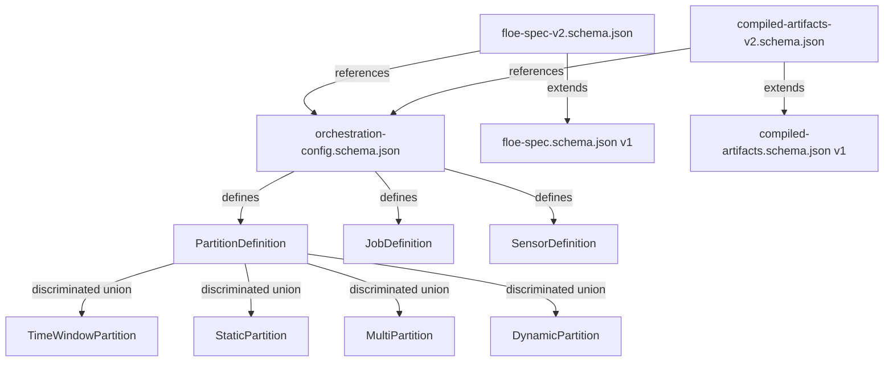

# Orchestration Auto-Discovery JSON Schema Contracts

This directory contains JSON Schema contracts for the orchestration auto-discovery feature that eliminates 200+ lines of boilerplate through declarative pipeline configuration.

## Schema Files

### 1. `orchestration-config.schema.json`
**Purpose**: Core orchestration configuration schema
**$id**: `https://floe.dev/schemas/orchestration-config.json`
**Description**: Defines the complete orchestration configuration structure including:

- **asset_modules**: Python module paths for asset auto-discovery
- **dbt**: dbt integration with per-model observability
- **partitions**: Named partition definitions (time_window, static, multi, dynamic)
- **assets**: Pattern-based asset configurations using glob patterns
- **jobs**: Job definitions (batch and ops jobs with discriminated unions)
- **schedules**: Cron-based schedule definitions
- **sensors**: Event-driven sensors (file_watcher, asset_sensor, run_status, custom)
- **backfills**: Historical backfill configurations

**Features**:
- Uses discriminated unions for type safety (oneOf with type discriminators)
- Comprehensive pattern validation for identifiers, cron expressions, module paths
- Environment variable interpolation syntax validation: `${VAR:default}`
- Cross-reference validation (job names, partition names)
- Rich examples and descriptions for IDE autocomplete

### 2. `floe-spec-v2.schema.json`
**Purpose**: Extended FloeSpec with orchestration support
**$id**: `https://floe.dev/schemas/floe-spec-v2.json`
**Description**: Backward-compatible extension of the existing floe.yaml schema with:

- All existing FloeSpec fields maintained (name, version, storage, catalog, compute, transforms, consumption, governance, observability)
- New optional `orchestration` field referencing orchestration-config.schema.json
- Maintains two-tier architecture with logical profile references
- Enhanced validation patterns for semver, identifiers, and URI formats

**Compatibility**: Fully backward compatible with existing floe.yaml files - orchestration section is optional.

### 3. `compiled-artifacts-v2.schema.json`
**Purpose**: Extended CompiledArtifacts with orchestration support
**$id**: `https://floe.dev/schemas/compiled-artifacts-v2.json`
**Description**: Output contract from floe-core compilation with orchestration support:

- Contract version bumped to "2.0.0" to indicate orchestration support
- New optional `orchestration` field containing resolved orchestration config
- All existing fields maintained for backward compatibility
- Enhanced metadata tracking for orchestration-enabled pipelines

**Contract Rules**:
- Model is immutable (frozen=True)
- Unknown fields rejected (additionalProperties: false)
- 3-version backward compatibility maintained
- Cross-language validation via JSON Schema

## Validation Features

### Pattern Validation
- **Identifiers**: `^[a-zA-Z][a-zA-Z0-9_]*$`
- **Module paths**: `^[a-zA-Z][a-zA-Z0-9_]*(\\.[a-zA-Z][a-zA-Z0-9_]*)*$`
- **Cron expressions**: `^([0-9*,-/]+\\s){4,5}[0-9*,-/]+$`
- **Semver**: Full semantic versioning pattern with pre-release and build metadata
- **Environment variables**: `${VAR:default}` syntax validation

### Discriminated Unions
All union types use proper discriminated unions with `oneOf` and type discriminators:
- **PartitionDefinition**: time_window, static, multi, dynamic
- **JobDefinition**: batch, ops
- **SensorDefinition**: file_watcher, asset_sensor, run_status, custom

### Cross-References
- Job references in schedules, sensors, backfills must exist in jobs dictionary
- Partition references in asset configs must exist in partitions dictionary
- Schema references use absolute URLs for proper resolution

## Environment Variable Support

All string fields support environment variable interpolation:
```yaml
# Examples from schema
cron_schedule: "${BRONZE_CRON:0 6 * * *}"
enabled: "${SCHEDULE_ENABLED:true}"
path: "${DATA_LANDING_PATH:/data/landing}"
manifest_path: "${DBT_MANIFEST_PATH:target/manifest.json}"
```

## Usage with IDEs

These schemas provide rich autocomplete and validation in modern IDEs:

### VS Code
Add to `settings.json`:
```json
{
  "yaml.schemas": {
    "https://floe.dev/schemas/floe-spec-v2.json": ["floe.yaml", "**/floe.yaml"]
  }
}
```

### JetBrains IDEs
Configure in Settings → Languages → Schemas and DTDs → JSON Schema Mappings

## Schema Relationships



## Testing Schema Validation

```bash
# Validate JSON syntax
python3 -m json.tool orchestration-config.schema.json

# Validate against meta-schema (requires ajv-cli)
ajv validate -s https://json-schema.org/draft/2020-12/schema -d orchestration-config.schema.json

# Test with example data
ajv validate -s orchestration-config.schema.json -d example-orchestration-config.yaml
```

## Migration Path

1. **Existing Pipelines**: Continue working without orchestration section
2. **New Pipelines**: Add orchestration section for auto-discovery benefits
3. **Gradual Migration**: Add orchestration section incrementally to existing pipelines
4. **Validation**: Use schemas for IDE support and CI/CD validation

These schemas enable the declarative orchestration auto-discovery feature while maintaining full backward compatibility and providing rich development experience through comprehensive validation and documentation.